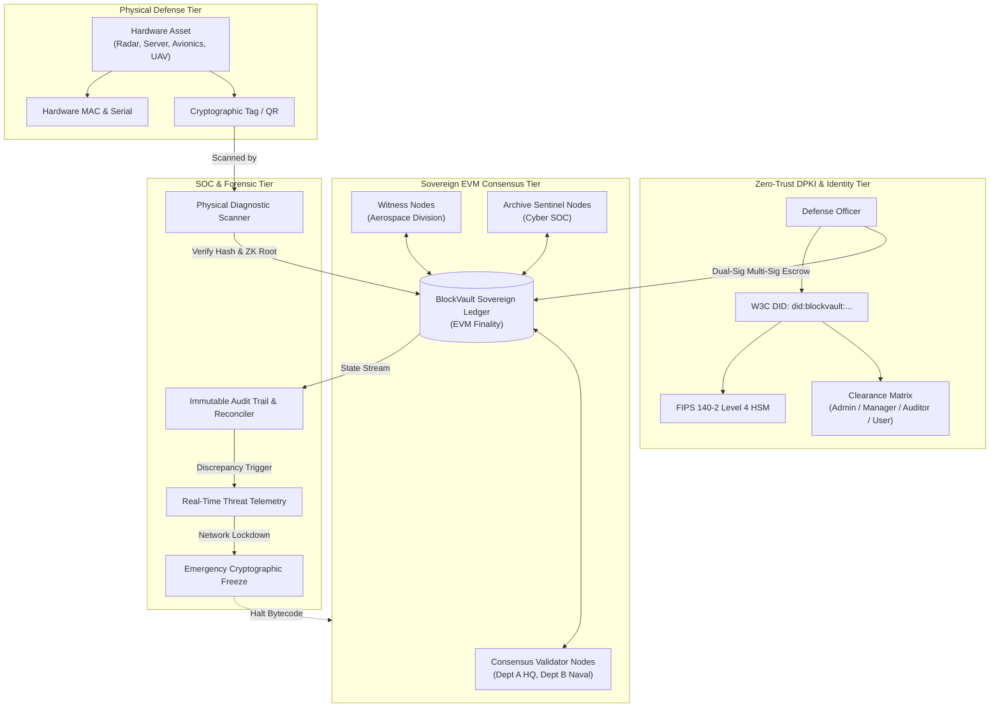

# 🛡️ BlockVault — Sovereign Trust Platform
### Defense-Grade Zero-Trust PKI, ERC-721 Hardware Tokenization & Real-Time EVM Consensus
**Smart India Hackathon (SIH) • Problem Statement PS 26125 • Bharat Electronics Limited (BEL)**

---

[](LICENSE)
[](https://react.dev/)
[](https://www.typescriptlang.org/)
[](https://vitejs.dev/)
[](https://tailwindcss.com/)
[](#)
[](#)

---

## 📌 Executive Summary

**BlockVault** is a sovereign defense infrastructure platform engineered for **Bharat Electronics Limited (BEL)** to guarantee uncompromising traceability, hardware provenance, and zero-trust identity verification across strategic military and defense assets.

Modern defense operations face sophisticated supply chain attacks, counterfeit hardware injection, and unauthorized equipment handovers. BlockVault solves this by marrying **Decentralized Public Key Infrastructure (DPKI)** with **ERC-721 physical asset tokenization** on an immutable, permissioned **EVM-compatible sovereign ledger**.

Every physical asset is bound to an on-chain digital twin via hardware-level cryptographic fingerprints (SHA-256 state hashes, MAC binding, physical tag attestation), and every custody transfer requires multi-signature cryptographically signed transactions by verified military personnel.

---

## 🏛️ System Architecture



---

## ⚡ Core Capabilities

### 1. 🪪 Zero-Trust DPKI Officer Identities
- **W3C Compliant DIDs**: Native format `did:blockvault:<wallet_address>`.
- **FIPS 140-2 Level 4 HSM Integration**: Hardware-rooted private key attestations for all cryptographic transactions.
- **Granular Role-Based Access Control (RBAC)**:
  - `Admin`: Chief Cryptographic Officer (Full sovereign control, key rotation, network freeze).
  - `Manager`: Operations Director (Multi-sig sign-offs, custody transfer authorization).
  - `Auditor`: Cyber SOC Lead Auditor (Ledger inspection, forensic audits, discrepancy logs).
  - `User`: Tactical Field Operator (Asset custody acknowledgement, physical tag scanning).
- **Clearance Segregation**: `TOP SECRET / SCI`, `DEFENSE CONFIDENTIAL`, `RESTRICTED DEFENSE`.

### 2. 🏷️ ERC-721 Hardware Tokenization & Digital Twins
- **Hardware-Level Binding**: Each tactical asset (radar units, encrypted servers, secure transceivers, avionics) is minted as a distinct ERC-721 smart contract token.
- **Immutable State Hashes**: SHA-256 state hashes bind physical MAC addresses, serial numbers, and firmware configurations to the block ledger.
- **Strict Lifecycle Management**: State machine supporting `Attested`, `Escrow`, `Decommissioned`, and `Tampered` statuses.

### 3. 🔍 Cryptographic Physical Scanner & ZK-Proof Verification
- **Rapid Field Verification**: Real-time diagnostic scanning of hardware assets using QR/barcode physical identifiers.
- **Tamper Simulation & Detection**: Immediate alerting when a physical signature diverges from the sovereign ledger state hash or ZK verification root.
- **Zero-Knowledge Attestation**: Verify hardware authenticity without exposing sensitive operational specifications.

### 4. 🤝 Dual-Signatory Multi-Sig Escrow Custody Handover
- **Cross-Departmental Custody**: Seamless transfers between `Department A (HQ)`, `Department B (Naval Fleet)`, `Cyber SOC (Defense Ops)`, and `Aerospace Division`.
- **2-of-3 Multi-Sig Validation**: Eliminates single-point-of-compromise insider threats by requiring cryptographic co-signing prior to custody finality.
- **Cryptographic Nonce Verification**: Protects against transaction replay attacks across offline and partitioned tactical networks.

### 5. ⛓️ Real-Time Sovereign EVM Consensus
- **Permissioned Defense Subnet**: Low-latency, deterministic block generation with verifiable gas usage metrics.
- **Node Redundancy**: Distributed across Consensus Validators, Witness Nodes, and Archive Sentinels.
- **Interactive Block Explorer**: Transparent, searchable transaction hashes, gas metrics, caller DIDs, and execution finality.

### 6. 🚨 Autonomous Cyber SOC & Emergency Network Freeze
- **Continuous Ledger Reconciliation**: Automatic comparison between off-chain cache/local databases and on-chain Merkle roots.
- **Autonomous SOC Incident Response**: Real-time triage of unauthorized access attempts, cryptographic signature mismatches, or key rotation anomalies.
- **Emergency Cryptographic Killswitch**: Immediate single-click freeze of state machine transitions in the event of an active cyber incident or physical facility breach.

---

## 📂 Project Structure

```text
blockvault/
├── index.html                  # HTML5 entry with defense font typography & dark theme
├── metadata.json               # Platform metadata & sovereign capability manifest
├── package.json                # Project dependencies, scripts & peer resolution
├── tsconfig.json               # Strict TypeScript configuration
├── vite.config.ts              # Vite 8 build & bundler configuration
└── src/
    ├── main.tsx                # React 19 root bootstrap
    ├── App.tsx                 # Core application controller & state machine
    ├── types.ts                # TypeScript domain models, DPKI interfaces & asset types
    ├── index.css               # Tailwind CSS v4 styling rules & custom themes
    ├── data/
    │   └── mockData.ts         # High-fidelity military assets, DIDs, nodes & block data
    └── components/
        ├── TopBar.tsx          # Defense status header, wallet connect & emergency controls
        ├── Sidebar.tsx         # Mission view navigation & clearance indicators
        ├── DashboardView.tsx   # Operational bento grid KPIs, blocks, & node health
        ├── IdentitiesView.tsx  # DPKI officer identity registry & key management
        ├── IdentityDetailView.tsx # Officer clearance, asset delegations & DPKI timeline
        ├── AssetsView.tsx      # Tokenized hardware inventory & provenance explorer
        ├── AssetDetailView.tsx # Physical hardware specs, token ID & lifecycle history
        ├── RBACView.tsx        # Departmental clearance matrix & role delegation
        ├── ScannerView.tsx     # Cryptographic scanner & tamper diagnostic engine
        ├── AuditView.tsx       # Smart contract auditor & ledger reconciler
        ├── NotificationsView.tsx # Real-time SOC security alerts & incident triage
        ├── SettingsView.tsx    # Node deployment, HSM configuration & consensus tuning
        └── modals/
            ├── CreateIdentityModal.tsx # New officer DPKI onboarding & key generation
            ├── RegisterAssetModal.tsx  # ERC-721 defense hardware minting modal
            ├── TransferModal.tsx       # Multi-sig custody handover workflow
            ├── DeployNodeModal.tsx     # Defense consensus/witness node orchestrator
            ├── EmergencyFreezeModal.tsx# Network-wide cryptographic killswitch confirmation
            ├── WalletModal.tsx         # DPKI wallet diagnostics & keypair inspection
            └── HelpModal.tsx           # Operational handbook & architecture guide
```

---

## 🛠️ Technology Stack

| Layer | Technology | Purpose |
|---|---|---|
| **Framework** | [React 19](https://react.dev/) | High-performance reactive UI rendering |
| **Language** | [TypeScript 7](https://www.typescriptlang.org/) | Strict type safety for defense data structures |
| **Bundler** | [Vite 8](https://vitejs.dev/) | Ultra-fast native ESM build and dev server |
| **Styling** | [Tailwind CSS v4](https://tailwindcss.com/) | Modern high-density tactical dark theme UI |
| **Motion** | [Motion](https://motion.dev/) | Fluid state transitions & UI micro-interactions |
| **Icons** | [Lucide React](https://lucide.dev/) | Standardized vector iconography |
| **Consensus & DPKI** | EVM-compatible PoA Architecture | Decentralized IDs, ERC-721 tokenization, Merkle state proofs |

---

## 🚀 Getting Started

### Prerequisites
- **Node.js**: `v18.0.0` or higher (Node 20+ recommended)
- **Package Manager**: `npm` (v9 or v10+)

### 1. Clone the Repository
```bash
git clone https://github.com/your-org/blockvault.git
cd blockvault
```

### 2. Install Dependencies
```bash
npm install
```
*(Dependencies are pre-configured to cleanly resolve Vite 8 and esbuild peer dependencies).*

### 3. Launch Development Server
```bash
npm run dev
```
The application will launch at:
- **Local:** [http://localhost:3000](http://localhost:3000)
- **Network:** Accessible across tactical LAN via `http://<host-ip>:3000`

### 4. Build for Production
```bash
npm run build
```
Production assets are generated in the `dist/` directory.

### 5. Type Checking & Verification
```bash
npm run lint
```
Executes `tsc --noEmit` to verify type safety across all components and models.

---

## 🔐 Clearance Matrix & Access Control

| Role | Clearance Level | Permitted Operations |
|---|---|---|
| **Admin** *(Chief Cryptographic Officer)* | `TOP SECRET / SCI` | Full system access, Emergency Network Freeze, DPKI identity revocation, node consensus reconfiguration |
| **Manager** *(Operations Director)* | `DEFENSE CONFIDENTIAL` | Asset registration (minting), custody transfer initiation & co-signing, departmental inventory management |
| **Auditor** *(Cyber SOC Lead)* | `TOP SECRET / CRYPTO` | Full read-only forensic inspection, ledger reconciliation, tamper audit execution, SOC incident resolution |
| **User** *(Field Operator)* | `RESTRICTED DEFENSE` | Asset scanning, physical tag verification, custody acknowledgement receipt |

---

## 🛡️ Security Compliance & Standards

- **W3C Decentralized Identifiers (DIDs) v1.0**: Standardized cryptographic identity schema.
- **ERC-721 Non-Fungible Token Standard**: Unique representation for each serialized hardware component.
- **FIPS 140-2 Level 4**: Hardware Security Module cryptographic boundary simulation.
- **NIST SP 800-207**: Zero-Trust Architecture guidelines (Never trust, always verify).
- **ISO/IEC 27001 & Common Criteria EAL4+**: Information security and tamper-resistant audit trails.

---

## 📜 License

This project is licensed under the **Apache-2.0 License**. See the [LICENSE](LICENSE) file for full details.

---

<div align="center">
  <sub>Developed for <b>Bharat Electronics Limited (BEL)</b> • Smart India Hackathon PS 26125</sub>
</div>
